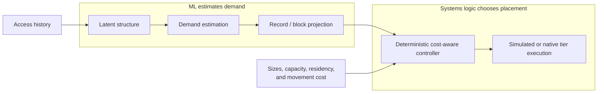

# Prism

Prism is an experimental storage-tiering system that explores whether learned
demand structure can help decide what data should remain in expensive fast
memory. It learns fuzzy latent working sets, estimates demand, projects that
demand to records or prefix blocks, and passes the result to a deterministic
cost-aware placement controller. The project spans controlled simulation, a
native C++ RAM/file-backed store, exact Python/C++ execution parity, and a pinned
LLM-serving simulator integration.

## Question and conclusion

Prism began with a stronger question: could context-informed forecasts move data
before abrupt demand changes and outperform reactive caching after movement
cost? Forecast metrics improved, but that improvement did not reliably produce
useful placement actions. Stable residual demand, record projection, migration
economics, and capacity competition dominated the controller.

The final thesis is:

> **Prism learns latent-demand structure and uses it for stable, cost-aware
> storage tiering.**

Dynamic predictive actionability was not demonstrated. Milestone 9, the planned
real heterogeneous deployment, was intentionally canceled at project closeout.

## Architecture



Synthetic hidden truth is separate from model-visible events. Compared policies
receive identical frozen traces. ML never chooses storage actions directly.

## What the experiments found

- The representative NMF recovered fuzzy working-set structure with mean cosine
  similarity `0.949876` and support recall `0.785291` versus `0.25` analytic
  chance.
- On the dedicated controlled trace, activation Brier score improved from
  `0.172441` to `0.159576`, and conditional-intensity RMSE improved from
  `0.378863` to `0.365930`.
- In the frozen 36-run placement study, Predictive Greedy (Prism) matched
  Validation-Final Frozen (Prism) in 35 runs and Recent-State-Only (Prism
  ablation) in cost in 34 runs.
- All four precommitted sparse, multi-window Milestone 5.5 candidate cells made
  zero test target changes and failed every actionability gate.
- The native engine passed deterministic correctness, corruption, atomicity,
  and sanitizer tests. Four Python policy paths matched 130,349 native
  operations with zero mismatches or capacity violations.
- In the pinned LLMServingSim run, static, frozen, predictive, LFU, and native
  LRU had identical TTFT and recomputation. Oracle added 56 MiB of transfer and
  was `1.401 ms` slower in mean TTFT.

These are controlled and simulator-specific results, not production or
real-hardware performance claims.

## Implementation highlights

- seeded contextual workload generator with leakage-safe hidden truth;
- deterministic NMF structure recovery and fixed linear forecast baselines;
- training-only record-demand projection and deterministic byte-constrained
  placement;
- frozen multi-seed controls, ablations, oracle diagnostics, and actionability
  gates;
- C++17 immutable two-tier store with CRC-verified reads and atomic exact-target
  transitions;
- private pybind11 boundary with an independent Python semantic-parity ledger;
- narrow LLMServingSim hook that leaves scheduling, active KV, transfers,
  recomputation, and timing simulator-owned.

## Quick start

Supported development environments are POSIX macOS and Linux with Python 3.11+
and CMake 3.24+. A C++17 compiler and zlib are required for the native extension.

```bash
python3 -m pip install -e .
python3 -m pytest -q
python3 -m compileall -q src tests
python3 -m pip check
```

Generate and validate the small representative workload:

```bash
PYTHONPATH=src python3 -m prism.workload.cli \
  --config configs/milestone1_representative.json \
  --output-dir /tmp/prism_m1

PYTHONPATH=src python3 -m prism.workload.validate \
  --run-dir /tmp/prism_m1 \
  --require-demonstrations
```

Build and test the standalone native engine:

```bash
cmake -S cpp -B build/cpp-debug \
  -DCMAKE_BUILD_TYPE=Debug \
  -DPRISM_BUILD_TESTS=ON \
  -DPRISM_WARNINGS_AS_ERRORS=ON
cmake --build build/cpp-debug --parallel
ctest --test-dir build/cpp-debug --output-on-failure
```

Run the forced Python/C++ parity fixture:

```bash
python3 -m prism.native.cli \
  --fixture \
  --output-dir /tmp/prism_native_fixture
```

The [reproducibility guide](docs/reproducibility.md) contains exact commands for
the full controlled pipeline, sanitizer builds, frozen experiment families, and
the pinned LLMServingSim integration.

## Repository map

| Path | Purpose |
|---|---|
| `src/prism/workload` | controlled trace generation and scientific validation |
| `src/prism/structure` | demand matrices and latent working-set recovery |
| `src/prism/predictor` | leakage-safe activation and intensity prediction |
| `src/prism/simulation` | projection, policies, controller, and cost replay |
| `src/prism/experiments` | frozen Milestone 5 and 5.5 orchestration |
| `src/prism/native` | deterministic payloads and Python/C++ parity |
| `src/prism/llm_sim` | pinned LLMServingSim policy integration |
| `cpp` | native immutable two-tier storage engine and tools |
| `configs` | committed experiment and controller configurations |
| `docs` | architecture, milestone evidence, and closeout documentation |
| `integration/llmservingsim` | isolated upstream hook and runtime definition |
| `tests` | deterministic, failure-path, leakage, and integration tests |

Start with the [final technical report](docs/final_report.md), the candid
[lessons learned](docs/lessons_learned.md), or the complete
[documentation index](docs/index.md).

## Project status

Prism is complete at `v1.0.0` as a reproducible research project. Milestones
1--8 are closed. Milestone 9 is canceled. The repository is not production-ready:
it has no asynchronous migration, concurrent native request path, mutable data,
or demonstrated heterogeneous-hardware advantage.
