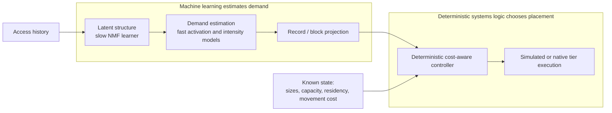

# Prism: Final Technical Report

## Introduction

Prism began as an attempt to answer a systems question: can learned demand
forecasts move data before a burst arrives, early enough to beat reactive
caching after paying for the movement? The project built the full chain required
to test that question rather than evaluating a predictor in isolation. It
generated controlled access histories, recovered latent working sets, forecast
their activation and intensity, projected those forecasts back to records, made
deterministic byte-constrained placement decisions, executed those decisions in
a native store, and finally connected the same policy boundary to an external
LLM-serving simulator.

The central hypothesis did not survive that chain. Forecast metrics improved,
but better factor forecasts did not reliably change record rankings or produce
promotions worth paying for. That negative result changed the thesis rather than
being edited out of it:

> **Prism learns latent-demand structure and uses it for stable, cost-aware
> storage tiering.**

This is a narrower claim than proactive predictive tiering. It is also the claim
the completed evidence supports.

## Original hypothesis

The original idea was plausible because reactive caches necessarily observe a
working-set change after its first misses. Prism's synthetic workload therefore
made abrupt, overlapping bursts the main event and planted imperfect contextual
precursors one window earlier. A slow learner would compress record demand into
fuzzy working sets; a fast model would estimate activation probability and
conditional intensity; a controller would promote records whose expected saved
reads exceeded movement cost.

That decomposition also made the hypothesis falsifiable. If prediction helped,
the improvement should survive four transformations: from observable context to
factor forecast, from factor forecast to record demand, from record demand to a
byte-constrained ranking, and from a proposed promotion to a net benefit after
movement. Prism measured each boundary separately.

## System architecture



The boundary is deliberate. ML handles uncertain future demand. The controller
handles known sizes, capacity, residency, access-cost difference, and movement
cost. Hidden synthetic truth is structurally separate from model-visible events
and enters only controlled evaluation and oracle diagnostics. Every compared
policy receives the same frozen trace.

## Controlled experimental foundation

The workload generator creates variable-sized immutable records, sparse fuzzy
memberships, overlapping working sets, true and false precursors, unannounced
bursts, baseline accesses, and uniform noise from an explicit local seed. The
representative seed-1729 trace contains 40 windows, 64 records, 2,604 events, 34
bursts, and 17 records belonging to more than one working set. Repeated runs are
byte-identical, and observable events contain no membership, precursor, burst,
or source label.

The slow learner uses one fixed deterministic nonnegative matrix factorization
of raw window-by-record counts. On the representative trace, its mean fuzzy
membership cosine similarity was `0.949876`, and mean support recall was
`0.785291` against an analytic random-support expectation of `0.25`. On the
longer training-only portion used by the predictor, the corresponding values
were `0.986697` and `0.900979`. These results establish that the planted latent
structure was recoverable without opening hidden truth during fitting.

The fast predictor used fixed logistic models for activation and fixed ridge
regression for conditional intensity. On 800 untouched test factor-window
examples, the context-plus-state model reduced pooled activation Brier score
from `0.172441` for the per-factor constant baseline to `0.159576`. On the
hidden-eligible diagnostic subset it improved Brier score from `0.308764` for
recent state to `0.305500`. Conditional-intensity RMSE improved from `0.378863`
for the per-factor mean to `0.365930`. All three predeclared predictor gates
passed. The improvements are real within the controlled trace; later results
show why they were not sufficient.

## From forecasting to placement

Prism projects factor demand through frozen fuzzy memberships using nonnegative
training-only calibration, then adds a learned per-record residual baseline. A
deterministic controller calculates expected access savings, subtracts promotion
cost for nonresident records, and greedily selects positive-benefit records by
benefit density under byte capacity. Exact and oracle variants diagnose
controller approximation and available opportunity; they are not deployable
policies.

Milestone 4 initially looked encouraging. On the seed-1729 controlled trace,
Predictive Greedy (Prism) had combined simulated test cost `57,764`, compared
with `70,440.7827` for Recent-Demand Greedy, `117,450.8765` for LFU, and
`142,642.9002` for LRU. Its hit rate was `0.5407`. But it promoted zero bytes in
test and retained the target it had developed during validation. Three of four
activation/intensity calibration coefficients were zero. The result showed a
good learned placement, but did not yet show ongoing anticipation.

Milestone 5 was designed to separate those explanations. It froze 12 variants,
three seeds, two static controls, and three mechanical forecast ablations before
examining aggregate results. All 36 engineering-valid runs completed twice with
byte-identical roots. Predictive Greedy (Prism) matched Validation-Final Frozen
(Prism) in 35 of 36 test runs and matched Recent-State-Only (Prism ablation) in
combined cost in 34 of 36. Only `promotion_0__seed_31415` changed test targets;
it saved `243` simulated cost units relative to frozen placement but slightly
reduced mean pre-transition realized-demand coverage (`0.749855` versus
`0.750047`).

The stable placement still contained useful learned information. Predictive
Greedy (Prism) beat Training-Popularity Static (Prism) in a majority of seeds for
9 of 12 variants, and factor-plus-residual forecasts beat the residual-only
ablation in all seeds for nine variants. The timing matters: most of that value
was acquired during validation and then held, not created by continued fast
prediction during test.

## Why prediction did not become action

Milestone 5.5 tested the most plausible rescue hypothesis without changing the
model or controller: perhaps sparser activations and cumulative horizons of two
or four windows would give forecasts enough time to act. The frozen 27-run sweep
crossed baseline, sparse, and very-sparse regimes with horizons `1`, `2`, and
`4`. Regime separation succeeded. Across seeds, starts per 100 windows fell from
`87.633` to `34.933` to `20.333`, while median dormant intervals rose from
`0.667` to `7.000` to `14.333` windows.

Forecasts moved, but their effect weakened during record projection. In the four
precommitted sparse multi-window candidate cells:

- the stable residual baseline contributed `87.34%` to `89.69%` of projected
  score magnitude;
- consecutive gross-benefit candidate sets had Jaccard similarity `0.9816` to
  `0.9929`;
- movement cost rejected between `12,588` and `22,878` nonresident candidates
  per cell, with capacity rejecting a further `1,353` to `11,052`;
- matched-horizon oracle Jaccard remained only `0.4502` to `0.5833`, so useful
  placement opportunity had not disappeared; and
- every candidate cell made zero test target changes, promotions, or evictions.

All four precommitted actionability gates failed in every eligible cell.
Predictive Greedy (Prism) was exactly equal to both Validation-Final Frozen
(Prism) and Recent-State-Only (Prism ablation) for each seed. Longer horizons
increased cumulative record-demand error rather than revealing a profitable
dynamic path. Milestone 5.5 therefore fixed the project conclusion as
`stable_cost_aware_tiering_reframe`.

The failure was not one bad metric. Stable residual demand dominated the record
score; factor movements rarely reordered candidates; promotion economics
removed many remaining opportunities; and byte competition removed more at the
longer horizon. Forecast quality and controller value were connected, but they
were not interchangeable.

## Revised thesis

Prism's supported contribution is a learned, stable, cost-aware placement
pipeline with explicit evidence boundaries. It recovers recurring latent demand,
develops placements that can improve on training-only popularity, respects
movement economics and byte capacity, and leaves final action selection to an
auditable deterministic controller.

It does not demonstrate that the present activation/intensity forecast creates
reliable dynamic placement value. Milestone 5.5 did not restore that claim, and
the external simulator result did not restore it either. The original question
remains scientifically open, but answering it would require a new project phase
that changes how transient factor signal survives projection and movement cost.

## Native storage engine

The C++17 engine turns the controller boundary into real storage operations
without embedding any placement policy. Immutable payloads live authoritatively
in a file-backed slow tier indexed by a versioned FlatBuffer with CRC32 per
record. The fast tier owns complete in-memory copies under a strict byte limit.
Slow reads do not promote, promotions do not choose victims, and exact-target
transitions stage and validate their complete next state before an atomic
in-process swap.

Debug, AddressSanitizer, and UndefinedBehaviorSanitizer suites cover format
validation, corruption, exact reads, capacity invariants, idempotence, failed
transition atomicity, counters, inspection, and replay. These results verify
storage semantics and integrity. The engine deliberately records no canonical
wall-clock timing, uses ordinary page-cache-influenced file I/O, and makes no
RAM-versus-SSD speed claim.

## Python/C++ integration

The private `prism._native` extension links the existing engine rather than
reimplementing it. Python retains forecasting, benefit calculation, and policy
decisions; C++ owns bytes, residency, integrity, movement, and counters. An
independent Python ledger compares every native operation rather than copying
expected state into the engine.

The accepted seed-1729 run replayed 22,809 validation/test reads per policy and
compared 130,349 operations across Training-Popularity Static (Prism), Predictive
Greedy (Prism), LRU, and LFU. All four paths completed with zero mismatches,
invalidations, unexpected exceptions, or capacity violations, and repeated
output roots were byte-identical. The representative predictive path made 15
initial promotions and no eviction across 400 target calls; forced fixtures,
not the representative experiment, provide dynamic-path coverage. This is exact
synchronous execution-parity evidence, not latency or predictive-actionability
evidence.

## LLM-serving simulator integration

Milestone 8 pinned LLMServingSim commit
`2c2042ce4bf1b0283ebeed1db95db6f25e3e7511` and inserted a narrow optional hook
around reusable, unlocked prefix-KV placement. Scheduling, active KV, prefix
matching, transfers, recomputation, and execution timing remained simulator
owned. Prism never placed cold-start blocks it had not observed in training, and
the Milestone 7 native store was not placed in the simulator path.

On the frozen 300-request Llama 3.1 8B configuration, LLMServingSim LRU, LFU,
Training-Popularity Static (Prism), Validation-Final Frozen (Prism), and
Predictive Greedy (Prism) all had identical mean TTFT of `16,225.878 ms` and
recomputed `2,832` blocks (`45,312` tokens). Oracle Greedy transferred 56 MiB
from host to GPU, recomputed the same number of blocks, and increased mean TTFT
by `1.401 ms`. Test demand was dominated by cold start: `94.22%` of logical
block references were absent from training.

Two complete six-policy runs produced byte-identical canonical artifacts. This
verifies the integration and preserves simulator-native timing within the pinned
configuration. It is a null/negative transfer result, not a real-hardware result
and not evidence that the original dynamic hypothesis recovered.

## Compact evidence summary

| Question | Result |
|---|---|
| Can latent working sets be recovered? | Yes on the controlled traces. Representative mean fuzzy cosine similarity was `0.949876`; support recall was `0.785291` versus `0.25` analytic chance. |
| Do learned predictors improve forecast metrics? | Yes on the dedicated controlled trace. Test activation Brier improved `0.172441 → 0.159576`; intensity RMSE improved `0.378863 → 0.365930`. |
| Does prediction reliably create dynamic placement value? | No under the tested precommitted regimes. Milestone 5 was frozen-equivalent in 35/36 runs; all four Milestone 5.5 candidate cells failed Gates A--D. |
| Can stable learned placement reduce cost or churn? | Yes within the simulator evidence. Predictive Greedy (Prism) beat Training-Popularity Static (Prism) in a majority of seeds for 9/12 Milestone 5 variants, usually without test migration. |
| Does the native engine execute placement correctly? | Verified by Debug/ASan/UBSan suites, corruption and atomicity tests, deterministic inspection, and replay. No performance claim is attached. |
| Does Python/C++ execution match exactly? | Yes for the four certified paths: 130,349 representative operations, zero mismatches or capacity violations. |
| Does the LLM simulator integration preserve realistic timing and cache behavior? | Verified within the pinned configuration: simulator scheduling/cache semantics remained authoritative and duplicate canonical runs were byte-identical. |

## What worked

- Structural separation prevented synthetic hidden truth from leaking into
  model-visible inputs or deployable artifacts.
- Fixed seeds, frozen traces, chronological splits, precommitted gates, and
  deterministic artifacts made negative results difficult to explain away.
- The slow representation recovered meaningful fuzzy overlap, and the fast
  models improved their declared forecast metrics.
- Static controls and mechanical ablations exposed where learned placement value
  came from.
- A policy-agnostic native engine and independent parity ledger verified the
  controller/storage boundary without changing the scientific conclusion.
- The external simulator integration retained upstream control of scheduling
  and execution, avoiding a self-confirming timing model.

## What did not work

- Forecast improvements did not produce reliable test-time target movement.
- The activation/intensity term was usually too weak after projection to change
  stable record rankings.
- Longer horizons accumulated more demand error and did not overcome movement
  economics.
- Sparse regimes created more dormant time but still failed every actionability
  gate.
- The LLM trace offered little training-seen recurrence and no capacity pressure
  for native LRU; Prism's policies changed residency without changing outcomes.
- The project did not establish real asynchronous prefetch, concurrent request
  serving, or measured heterogeneous-hardware benefit.

## Limitations

The controlled placement results use simulated access and promotion costs. The
multi-seed studies contain three seeds per cell and report descriptive paired
outcomes without confidence intervals or significance tests. Raw costs should be
compared within a variant and seed because generated event counts differ.

The native engine is synchronous, immutable, single-process, and untimed. It has
no writeback, concurrency, direct I/O, background migration, or crash-recovery
protocol. The Python binding holds the GIL and copies read payloads.

The LLM result covers one pinned simulator revision, model, hardware profile,
trace, split, budget, and controller cost. Native LRU's reusable catalog fit in
available simulator capacity, and 94.22% of test references were cold-start
blocks. Neither simulator output nor semantic parity establishes production
performance.

## Future directions

The most useful open question is not whether a more elaborate predictor can
lower an abstract loss. It is how to preserve transient signal through
factor-to-record projection and make enough economically repayable changes to
matter. A future investigation should begin with that interface and should
precommit action-level gates again. Possible research directions include a
projection that explicitly separates stable and transient demand, workloads with
measured repeatable transition opportunity, and asynchronous prefetch semantics
whose costs are observable.

Those are research directions, not commitments in this repository. Milestone 9,
the planned real heterogeneous deployment, was intentionally canceled at
closeout because the simulator did not expose a credible performance claim to
validate on hardware.

## Reproducibility

The [reproducibility guide](reproducibility.md) records the supported environment,
installation, Python and native test commands, sanitizer builds, representative
experiment entry points, Milestone 8 integration command, and artifact policy.
The compact starting point is:

```bash
python3 -m pip install -e .
python3 -m pytest -q
python3 -m compileall -q src tests
python3 -m pip check
```

Large experiment roots are intentionally written outside the repository. The
accepted scientific claims above come from the committed reports for
[Milestone 5](milestone5_results.md),
[Milestone 5.5](milestone55_results.md), and
[Milestone 8](milestone8_results.md), plus deterministic representative commands
documented in the reproducibility guide.
